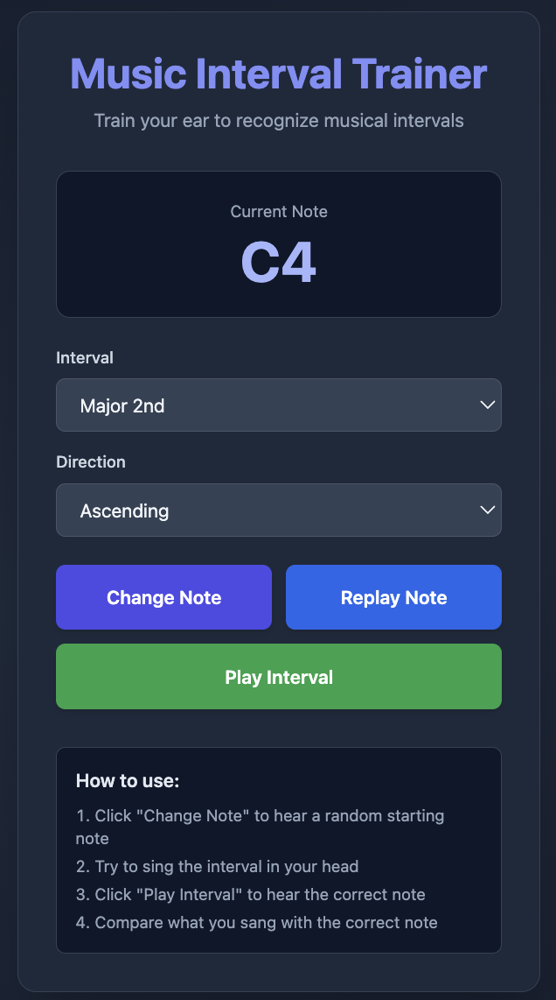

# 🎵 Music Interval Trainer

An interactive web application for training your ear to recognize musical intervals, the DNA of music. Practice singing intervals by first hearing a note, attempting to sing the target interval, and then checking your accuracy.



## 🎯 Features

- **Random Note Generation**: Practice with any chromatic note across multiple octaves (C3-B5)
- **11 Musical Intervals**: Train with all common intervals from minor 2nd to octave
- **Ascending & Descending**: Practice intervals in both directions
- **Real-time Audio**: Browser-based audio synthesis using Web Audio API
- **Clean, Responsive UI**: Works seamlessly on desktop and mobile devices
- **No Installation Required**: Runs entirely in the browser

## 🛠️ Tech Stack

- **Frontend**: React 18, TypeScript
- **Styling**: Tailwind CSS
- **Build Tool**: Vite
- **Audio**: Web Audio API
- **Deployment**: GitHub Pages

## 🚀 Live Demo

**[Try it now →](https://lgivhan.github.io/music-interval-trainer/)**

## 💻 Getting Started

### Prerequisites

- Node.js 18 or higher
- npm or yarn

### Installation

1. Clone the repository:
```bash
git clone https://github.com/lgivhan/music-interval-trainer.git
cd music-interval-trainer
```

2. Install dependencies:
```bash
npm install
```

3. Start the development server:
```bash
npm run dev
```

4. Open your browser to `http://localhost:5173`

### Building for Production

```bash
npm run build
```

### Deploying to GitHub Pages

```bash
npm run deploy
```

## 📖 How to Use

1. **Click "Change Note"** to generate and hear a random starting note
2. **Select an interval** from the dropdown (e.g., "Major 3rd")
3. **Choose direction** (Ascending or Descending)
4. **Try to sing** the target interval in your head or out loud
5. **Click "Play Interval"** to hear the correct note
6. **Compare** what you sang with the actual interval

## 🎼 Available Intervals

- Minor 2nd (1 semitone)
- Major 2nd (2 semitones)
- Minor 3rd (3 semitones)
- Major 3rd (4 semitones)
- Perfect 4th (5 semitones)
- Tritone (6 semitones)
- Perfect 5th (7 semitones)
- Minor 6th (8 semitones)
- Major 6th (9 semitones)
- Minor 7th (10 semitones)
- Major 7th (11 semitones)
- Octave (12 semitones)

## 🔮 Future Enhancements

- **Song References**: Add references to songs for interval memorization
- **Pitch Detection**: Use device microphone to automatically detect sung notes and provide real-time feedback
- **Accuracy Scoring**: Visual indicators showing how close your sung note was to the target
- **Progress Tracking**: Save your practice history and track improvement over time
- **Quiz Mode**: Timed challenges with scoring system
- **Custom Ranges**: Select specific octave ranges for practice
- **Instrument Selection**: Choose between different sound waves (sine, square, triangle, piano)

## 🤝 Contributing

Contributions are welcome! Feel free to open an issue or submit a pull request.

## 📄 License

MIT License - feel free to use this project for learning and development.

## 🙏 Acknowledgments

- Built using Claude.ai
- Inspired by traditional ear training exercises used in music education